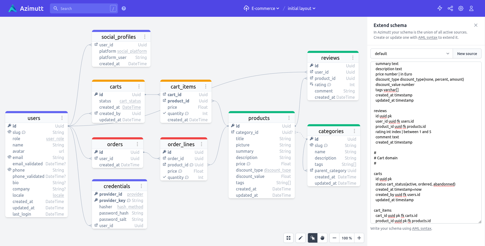

# Full example

Let's define a hypothetical e-commerce shop:



```aml
#
# Identity domain
#

users
  id uuid pk
  slug varchar unique | user identifier in urls
  role user_role(customer, staff, admin)
  name varchar
  avatar url
  email varchar unique
  email_validated timestamp nullable
  phone varchar unique
  phone_validated timestamp nullable
  bio text nullable
  company varchar nullable
  locale locale(en, fr)
  created_at timestamp
  updated_at timestamp
  last_login timestamp

credentials
  provider_id provider(google, facebook, twitter, email) pk
  provider_key varchar pk | user id in provider system
  hasher hash_method(md5, sha1, sha256)
  password_hash varchar
  password_salt varchar
  user_id uuid fk users.id

social_profiles
  user_id uuid fk users.id
  platform social_platform(facebook, twitter, instagram, slack, github)
  platform_user varchar
  created_at timestamp

#
# Catalog domain
#

categories
  id uuid pk
  slug varchar unique | category identifier in urls
  name varchar
  description text
  tags varchar[]
  parent_category uuid fk categories.id
  created_at timestamp
  updated_at timestamp

products
  id uuid pk
  category_id uuid nullable fk categories.id
  title varchar
  picture varchar
  summary text
  description text
  price number | in Euro
  discount_type discount_type(none, percent, amount)
  discount_value number
  tags varchar[]
  created_at timestamp
  updated_at timestamp

reviews
  id uuid pk
  user_id uuid fk users.id
  product_id uuid fk products.id
  rating int index | between 1 and 5
  comment text
  created_at timestamp

#
# Cart domain
#

carts
  id uuid pk
  status cart_status(active, ordered, abandonned)
  created_at timestamp=now
  created_by uuid fk users.id
  updated_at timestamp

cart_items
  cart_id uuid pk fk carts.id
  product_id uuid pk fk products.id
  price number
  quantity int check="quantity > 0" | should be > 0
  created_at timestamp

#
# Order domain
#

orders
  id uuid pk
  user_id uuid fk users.id
  created_at timestamp

order_lines
  id uuid pk
  order_id uuid fk orders.id
  product_id uuid fk products.id | used as reference and for re-order by copy data at order time as they should not change
  price number | in Euro
  quantity int check="quantity > 0" | should be > 0
```

Hope you enjoyed AML, happy hacking on [Azimutt](https://azimutt.app)!
